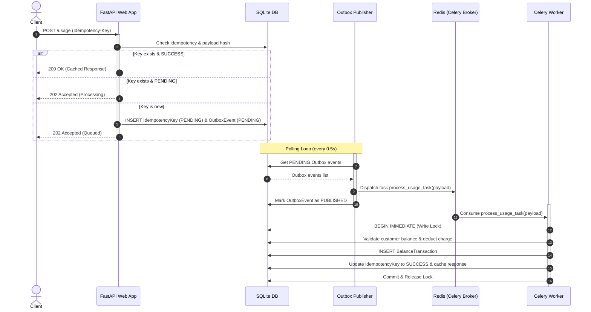

# Usage-Based Billing Service: Design and Architecture

This document tracks the architectural decisions, design patterns, and database schemas implemented for the Usage-Based Billing Service.

---

## 1. Technology Stack

- **Runtime**: Python 3.12.13 (enforced via `pyproject.toml`)
- **Package Manager**: `uv` (fast, deterministic dependency resolution using `uv.lock`)
- **API Framework**: FastAPI (high performance, modern ASGI, native OpenAPI/Swagger support)
- **Database**: SQLite (local single-file database)
- **ORM**: SQLAlchemy 2.0 with asynchronous engine (`aiosqlite` driver)
- **Migrations**: Alembic (manages database schema upgrades and updates dynamically)
- **Task Queue**: Celery with Redis broker (for asynchronous outbox processing in later phases)
- **Testing**: `pytest` with `pytest-asyncio` and `httpx` (configured for isolated test environments)

---

## 2. Core Architectural Principles

- **Layered Architecture**: Clear separation of responsibilities:
  - **Routers**: API endpoints handling request parsing, HTTP status codes, and input validation.
  - **Schemas**: Pydantic v2 validation models.
  - **Services**: Pure business logic orchestrating operations across multiple repositories.
  - **Repositories**: Direct database queries and database-level object management.
  - **Models**: Declarative SQLAlchemy tables.
- **Monetary Representation**: To prevent rounding errors, all monetary amounts (balances, transactions, unit prices) are stored using Python's `decimal.Decimal` and SQLite's `NUMERIC(18, 4)` representation.
- **Transactional Safety**: Balance modifications and transaction logging are performed atomically inside unified database session blocks to protect financial invariants.

---

## 3. Database Schema

### `customers`
Stores customer prepaid balances.
- `id` (VARCHAR(36), PK): UUID generated on the client or server.
- `name` (VARCHAR): Customer name.
- `balance` (NUMERIC(18, 4)): Prepaid balance (default 0.0).

### `products`
Stores billing products and their unit prices.
- `id` (VARCHAR(36), PK): UUID.
- `name` (VARCHAR): Product name.
- `price_per_unit` (NUMERIC(18, 4)): Pricing per unit consumed.

### `balance_transactions`
Auditable financial ledger tracking credits and charges.
- `id` (VARCHAR(36), PK): UUID.
- `customer_id` (VARCHAR(36), FK): Reference to `customers.id` (cascade delete, indexed).
- `amount` (NUMERIC(18, 4)): Credit amount (positive) or charge amount (negative).
- `product_id` (VARCHAR(36), FK, Nullable): Associated product for usage-based charges.
- `quantity` (NUMERIC(18, 4), Nullable): Amount consumed.
- `unit_price_at_time` (NUMERIC(18, 4), Nullable): Historic unit price at the time of charge (ensures price audit safety).
- `created_at` (DATETIME, indexed): Ledger timestamp.

### `idempotency_keys`
Tracks and deduplicates incoming API requests.
- `key` (VARCHAR(255), PK): Idempotency identifier sent in request headers.
- `request_path` (VARCHAR(255)): Targeted endpoint.
- `payload_hash` (VARCHAR(64)): SHA-256 hash of the request payload to detect mismatches.
- `status` (VARCHAR(50)): Status of request processing (`PENDING`, `SUCCESS`, `FAILED`).
- `response_body` (JSON, Nullable): Cached success response payload.
- `created_at` (DATETIME): Request timestamp.

---

## 4. Concurrency Protection & SQLite Configuration

SQLite operates concurrently by using the following optimizations configured in [app/database.py](file:///Users/bencata/Desktop/studies/job_eyal/senior-python-usage-billing-assignment/app/database.py):
1. **WAL (Write-Ahead Logging)**: Enabled via `PRAGMA journal_mode=WAL` to allow multiple concurrent readers to access the database without blocking write transactions.
2. **Busy Timeout**: Configured via `PRAGMA busy_timeout=5000` to make SQLite wait up to 5 seconds for write locks to clear instead of throwing immediate lock errors.
3. **Transaction Serialization**: Configured via a SQLAlchemy connection listener that overrides default deferred locking with `BEGIN IMMEDIATE` for database write sessions. This forces a write lock from the beginning of the transaction, eliminating race conditions or deadlocks where two transactions attempt to read first and then write simultaneously.

---

## 5. Asynchronous Outbox Pattern Architecture

To guarantee reliable event delivery, high throughput, and at-least-once task execution, the usage ingestion pipeline uses the **Transactional Outbox Pattern**.

### Workflow Steps

1. **Ingestion & Validation**:
   - The client sends a `POST /usage` request with an `Idempotency-Key` header.
   - The web app calculates a payload hash and checks `idempotency_keys` for duplicates/conflicts.
2. **Atomic Outbox Persist**:
   - If unique, the web app writes a `PENDING` record in the `idempotency_keys` table and inserts a `PENDING` event into the `outbox_events` table inside the same SQLite transaction.
   - Once persisted, the client immediately receives a `202 Accepted` response.
3. **Outbox Polling & Dispatch**:
   - The **Outbox Publisher** is a background loop running inside the FastAPI web process.
   - It polls the database for `PENDING` outbox events, dispatches them to Redis (Celery broker), and marks them `PUBLISHED` in a separate transaction to avoid holding active database locks.
4. **Asynchronous Execution (Celery)**:
   - The **Celery Worker** consumes the task from Redis, loads customer/product details, validates balance limits, processes the charge, records the balance transaction, and marks the idempotency key as `SUCCESS` with the cached response body.

### Architecture Diagram

